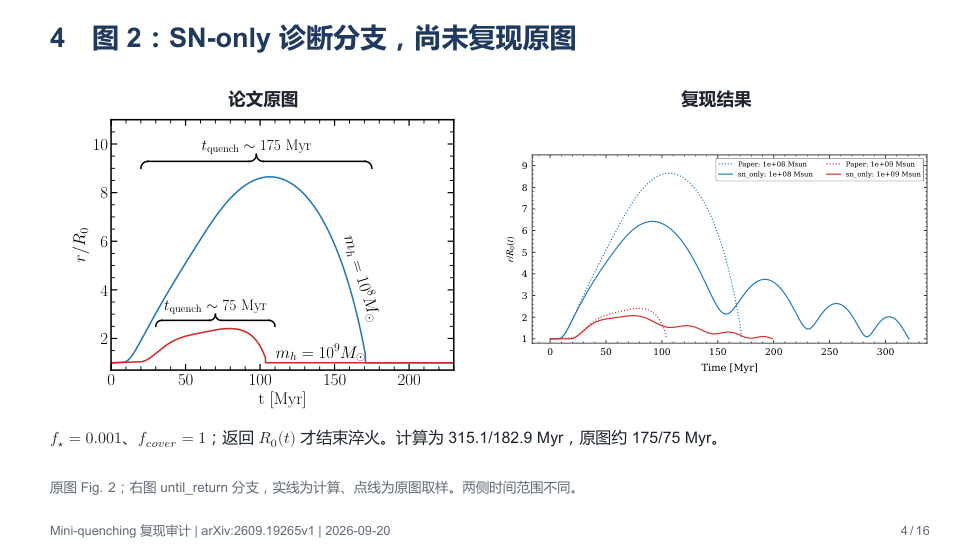

# 给 GPT Pro 的阅读入口：Mini-quenching 复现失败诊断

这份仓库包含实际运行过的独立 Python 实现、论文原文与源包、机器可读输出、测试和中文报告。**尚未完整复现论文；请审查物理定义和实现，不要把已有状态文档当作正确性证明。**

目标论文：Judah Luberto & Steven R. Furlanetto，*A model to mini-quench early galaxies by balancing stellar feedback and gas accretion*，固定 [arXiv:2609.19265v1](https://arxiv.org/abs/2609.19265v1)。

## 当前最需要解决的问题

图 2 的原图只有一次外推和回落；SN-only 计算出现多次反弹，淬火时间为 315.1/182.9 Myr，明显长于原图粗读的 175/75 Myr（两条曲线初始暗晕质量分别为 1e8/1e9 Msun）。图中形成效率 **f_star=0.001**。

已经确认：

- 右图是 **SN-only + until_return** 诊断分支，既省略 UV/Lyα，也在回落时继续给壳层加载吸积质量。它不是已确认的作者完整模型。
- 原文 §2.9 写的是仅外流时加载；回落继续加载是实现者采用的替代分支，不能一概称作原文歧义。低层 `Config` 与扫描 CLI 的加载默认值不同。
- 蓝线首次反弹约在 157.5 Myr，此时 SFR 与 SN 率均为零。压力力约为内向合力的 1.98 倍。
- `dP/dt = L_SN/(2πr³) - 5Pv/r - P/t_comp` 在回落时有压缩增压。SN 结束后保存数据满足 `P*r^5*exp(t/t_comp)` 近似不变。反弹机制能在当前方程中解释，但作者原图为何没有反弹仍未确定。
- 加密蓝线：315.067442 → 315.062987 Myr，反弹仍存在。因此减小步长不能消除当前差异。
- 仅外流加载的补跑：1e8 Msun 变成 390.483 Myr、5 次反弹；1e9 Msun 在速度切换处超过 50000 RHS 次数而明确失败。这个数值处理缺口尚未修复。
- full_approx 不是严格完整模型：包括真实外部力倍增拟合与冷却数据，但恒星半径、壳层厚度和热学闭合含未确认推断。它也没有解决图 2。

## 建议阅读顺序

1. [图 2 最新诊断](docs/figure2_failure_audit.md) 与 [诊断实测 JSON](data/figure2_rebound_audit.json)。
2. [原文 TeX](external_data/paper/source/main.tex)，重点 §2.1、2.2、2.3、2.7、2.9，以及图 2 图注；联合核对 [PDF](external_data/paper/paper.pdf) 与 [HTML](external_data/paper/paper.html)。
3. [动力学](miniquench/dynamics.py)、[尺度/增长/压力](miniquench/physics.py)、[历史反馈](miniquench/feedback.py)、[辐射项](miniquench/radiation.py)。
4. [扫描 CLI](scripts/reproduce.py)、[配置](configs/)、[单轨道数据](data/curves/)、[测试](tests/)。
5. [公式映射](docs/equation_map.md)、[参数](docs/parameters.md)、[此前歧义记录](docs/ambiguities.md)。这些是待审核的实现者解释，不是作者代码。
6. [中文总报告](reproduction_report.md)、[逐图状态](data/figure_status.json)、[16 页对照 PDF](slides/reproduction_review.pdf)。

## 交给 GPT Pro 的任务文本

> 请独立审计这个仓库为何未能复现 arXiv:2609.19265v1 图 2，并给出有原文依据的修复。不要假定当前报告里的“歧义”分类正确，也不要为了消除反弹而删除压缩功或添加任意耗散。逐项区分：原文明确要求、当前实现违反原文、原文真正未指定、数值算法失败。特别核查总质量与包围质量、启动约束与停止形成的时刻、回落时质量/动量加载、热泡能量方程和移动 R0(t)。代码的数值收敛与物理模型等价性必须分别证明。修复后先验证图 2 两条单轨道，再扩展扫描；不得用当前 SFR 替代历史反馈，也不得把第一次转向当作淬火结束。请保留失败和未返回状态，明确尚不能确定的作者实现细节。

## 已运行的证据与范围

- 原测试套件 24 项通过，见 [日志](outputs/logs/pytest_final.txt)。这些不是论文等价性证明。
- [收敛表](data/convergence.csv)、[分支敏感性](data/sensitivity.json)、[论文残差](data/paper_comparison.json) 分别保存。
- 图 1 六条参数化 IMF 曲线 reproduced；图 4 approximate；图 2/5/8 full_approx blocked，SN-only 仅作诊断；其余图 not_run。
- 完整扫描与机器可读曲线在 `data/curves/`；缓存和 `.venv` 不进入 Git，结果文件保留实际运行配置及物理代码指纹。
- 外部资料及校验值见 [manifest](data/manifest.json)。`data/reference/` 是从作者矢量 PDF 提取的参考路径，不是作者求解器数组。没有找到目标论文作者的计算代码。

运行入口与已测试命令见 [README](README.md)。目录结构在独立仓库根下有效，不需要父级 AuroraLF 项目。
